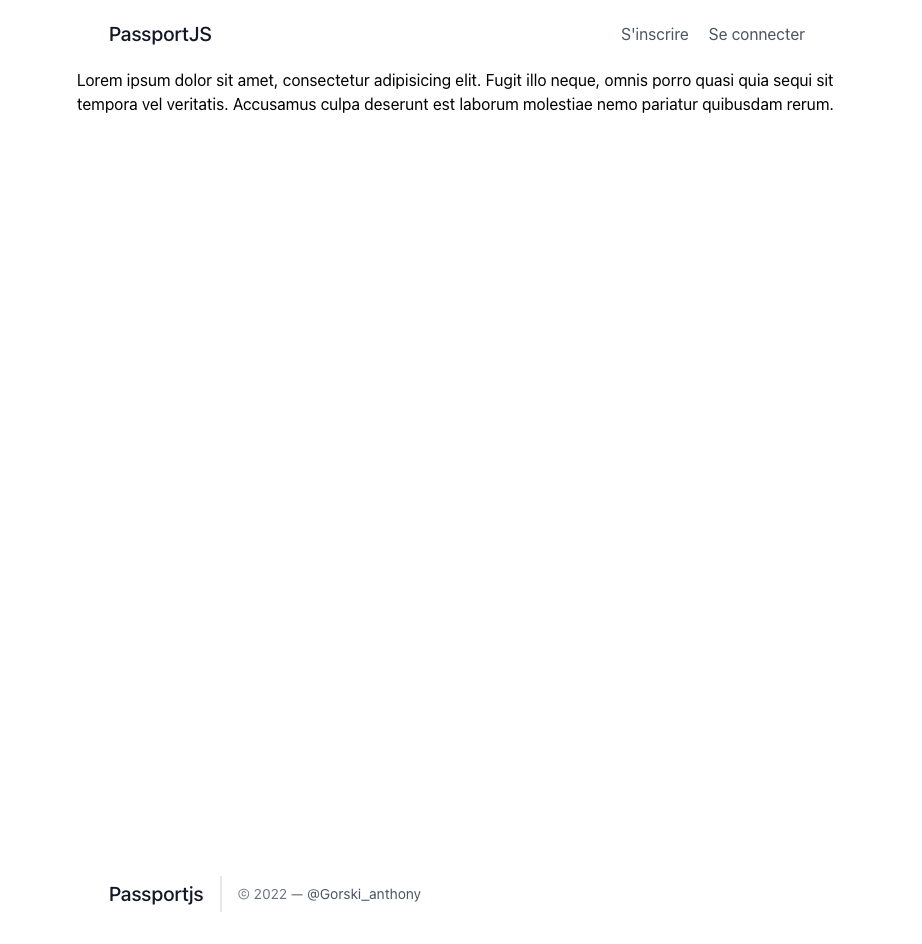
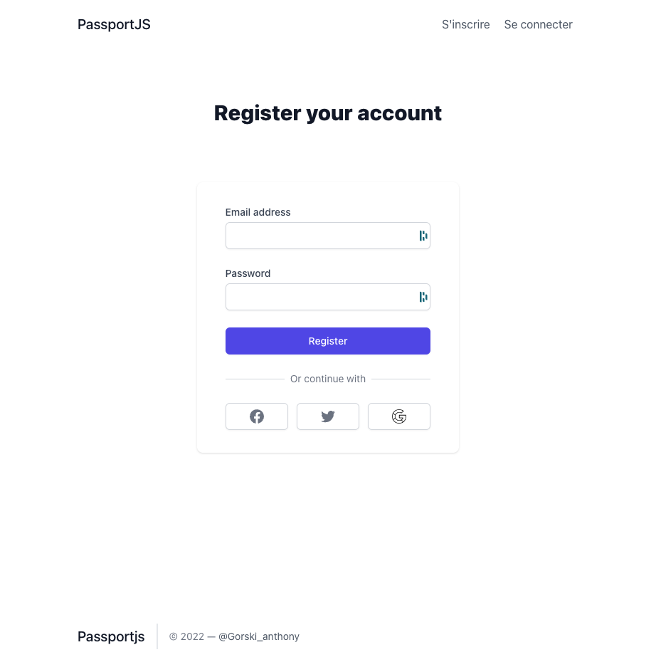
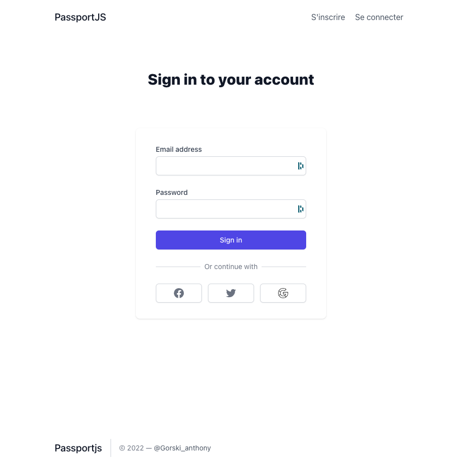

# 🖥 Client

## Installation

Nous avons fait une installation :

```shell
npx create-react-app client
# On ajoute le router :
npm install react-router-dom
```

## Configuration

J'ai fais un petit template, histoire d'avancer un peu.

### home


### register



### sign in


